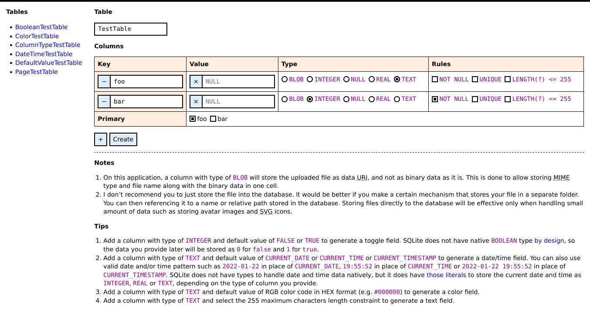
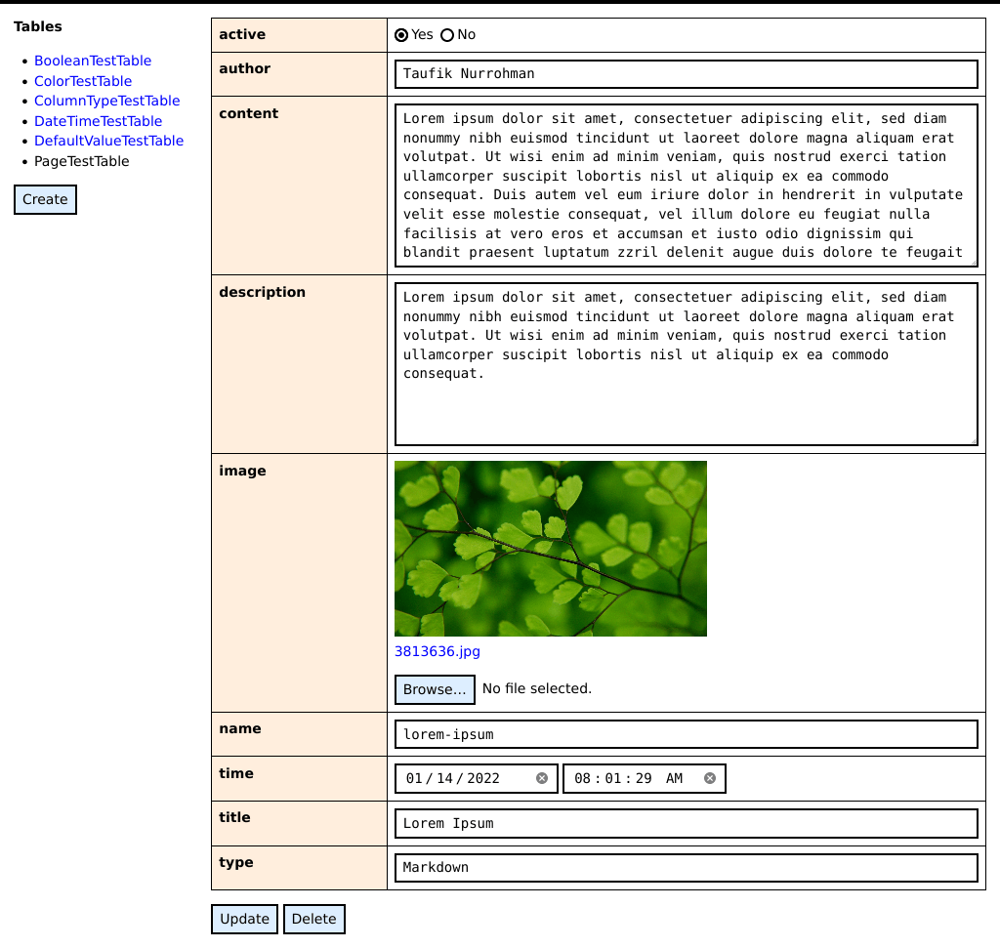

Table Manager
=============

> This is a SQLite database management system initiation to help me in creating database feature for [Mecha](https://github.com/mecha-cms).

Features
--------

 - [ ] Add column.
 - [ ] Filter rows.
 - [x] Color preview.
 - [x] Create table.
 - [x] Delete row.
 - [x] Drop column.
 - [x] Drop table.
 - [x] Image preview.
 - [x] Insert row.
 - [x] Paginate rows.
 - [x] Rename column.
 - [x] Rename table.
 - [x] Update row.
 - [x] View (select) table.
 - [x] View (select) tables.